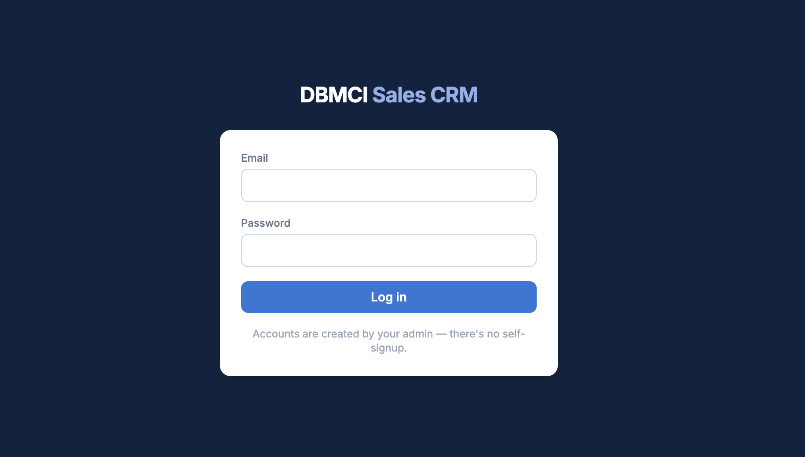
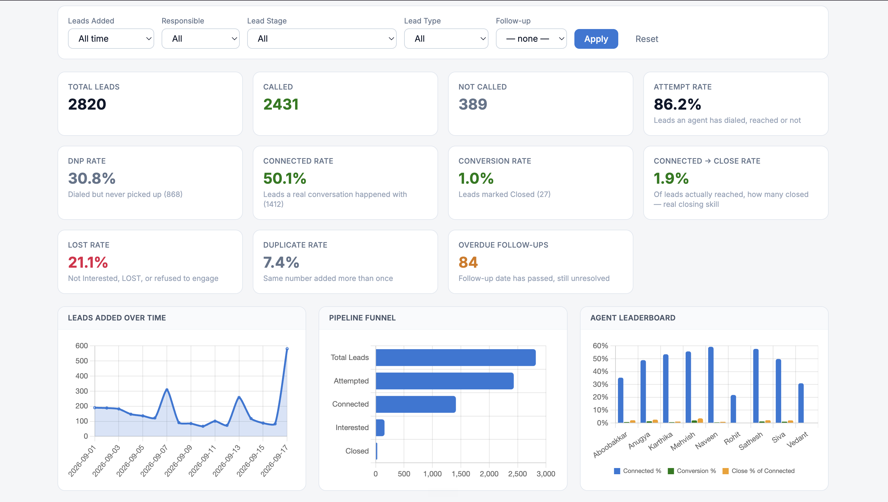
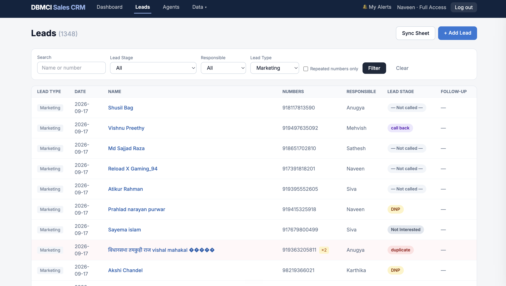
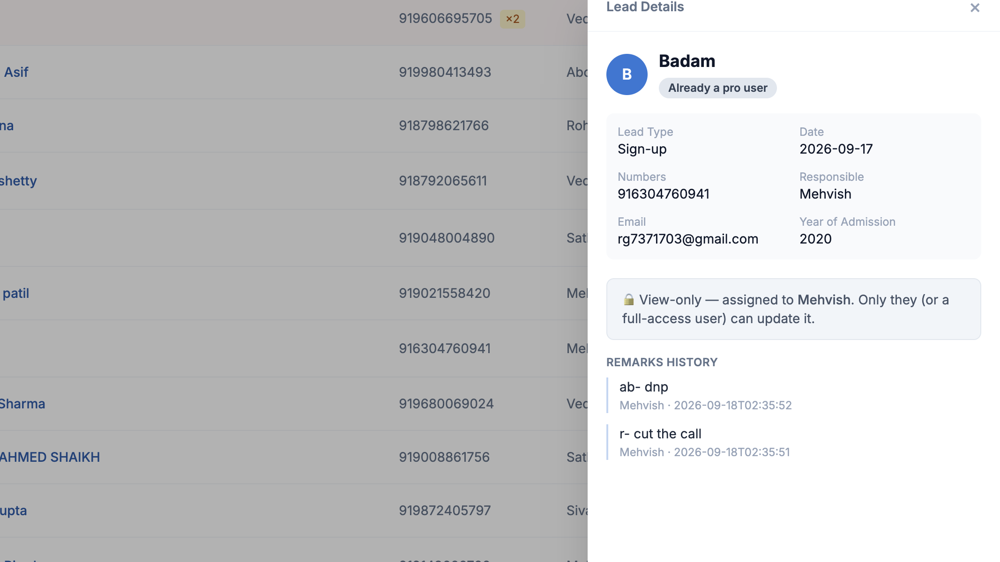

# Custom Inside Sales CRM

Built for a real inside sales team's actual day-to-day problems — by talking to Claude, not by buying or hand-coding a generic CRM.

## 1. The Problem

Our sales team runs entirely on phone calls — agents calling leads every day, working out of a shared Google Sheet. That setup created real, recurring problems:

- **Data safety** — a shared spreadsheet anyone can edit isn't a safe place to keep customer data.
- **Human error scrambles the sheet** — with multiple people editing the same rows daily, a phone number slides away from the name it belongs to, or from its own remarks and follow-up date. An agent ends up calling with the wrong context, and sometimes the whole sheet has to be manually re-sorted to fix it.
- **Duplicate leads, duplicate calls** — leads come in from four different sources (Marketing, our website's landing page, sign-ups, and expiry/returning customers), and the same phone number often lands twice. Two agents can end up calling the same person days apart. Our leads are doctors — busy people who don't appreciate being called twice about the same thing.
- **Missing the right time to call** — a lead who says "call me at 4pm" is telling us exactly what to do, but agents work through the list in batches, mostly in the evening. That window quietly passes and a warm lead goes cold.
- **No visibility for the manager** — leads land every morning, but there's no practical way to check whether each one got called, how fast, or whether a promised follow-up happened — without sitting in the sheet all day.

**If these are solved**, the business keeps more of the leads it's already paying to generate — faster response, fewer damaged relationships, and a manager who can see and fix problems before they cost a sale.

## 2. The Solution

- **Leads still start in the same Google Sheet** — one click ("Sync Now") pulls new rows into the CRM.
- **Duplicate numbers are caught automatically** — flagged with a badge showing exactly how many times a number has come in.
- **Every call, remark, and stage change is permanent history** on that lead.
- **Exact-time Slack reminders** — if a lead needs a callback at a specific time, the assigned agent gets pinged on Slack the moment it arrives.
- **A manager dashboard** showing, without opening a sheet: how many leads are being attempted, how many are actually being reached, how many are converting, which agents are struggling to get through versus struggling to close, and how many follow-ups are overdue right now.
- **Real access control** — the manager can add, edit, delete, and reassign anything. An agent can only edit leads assigned to them, enforced by the server.

## 3. How We Got Here

This CRM was built entirely by describing these problems, in plain conversation, to Claude — no line of it hand-coded. **It was built in about one to two days**, under real time pressure. With more time and ongoing back-and-forth with the whole team, it can be made significantly better — this is a fast first build, not a finished product.

That said, real engineering happened in those two days, not just generation: when the sheet grew and a sync started crashing, we traced it to thousands of one-by-one database calls and rebuilt it to batch the work — cutting a sync that couldn't finish in six minutes down to 13 seconds. That same fix briefly introduced a connection leak that took the whole app offline; we found it, fixed it, and verified against the live system. Every commit in the project's history carries the AI's name as a co-author — checkable in the repo, not a claim.

**This is not a demo with fake data.** Everything shown in the screenshots below — the leads, the call outcomes, the dashboard numbers — is the real sales team's real work from this month (September), synced live from the sheet they use every day. It's a working tool in daily production use, not a mockup built to look good.

## 4. How This Helps the Business

- **No CRM subscription** — the cost was the time spent describing the problem, not a monthly bill for features we'd never use.
- **Protects relationships with leads** — no more calling the same person twice.
- **Faster follow-up means more closed deals** — calling at the time a lead actually asked for.
- **The manager can manage, not just hope** — she can see who's falling behind, why, and step in before a lead is lost.
- **The data is finally safe and structured** — no longer a spreadsheet anyone with the link can quietly break.

## 5. What's Next

This was built in two days to solve today's problems. Here's what a longer runway opens up:

- **One-click calling** — right now agents still dial each number manually from the CRM, which costs real time. (We briefly had a simple click-to-call link, but pulled it back out because it opened FaceTime instead of the phone dialer on Android — the honest next step is a proper telephony integration, not just re-adding that.)
- **AI sitting next to the CRM** — connecting Claude directly into the tool so it can read through agents' call remarks over time and surface patterns — which objections keep coming up, which leads look most worth prioritizing — so decisions aren't just based on gut feel.
- **Moving off Google Sheets as the source of leads** — leads still originate in a spreadsheet today, which won't hold up as volume grows or as source systems change. The next step is a dedicated lead-intake pipeline: each source (marketing forms, the website signup flow, the expiry list) posts leads directly into the CRM's own database through a proper API, with the sheet becoming an optional manual-entry fallback instead of the system of record.
- **More time with the team** — this was built solo, fast, under pressure. Built out properly with the whole team's input over weeks instead of days, it can cover a lot more of how the business actually runs.

## 6. Technical Details, in Plain Terms

- **Built with:** Python (Flask) for the web app, PostgreSQL (hosted on Supabase) for the database, Render for hosting it live, Slack for real-time call reminders, Chart.js for the dashboard charts, and GitHub for code and version history.
- **How it was built:** entirely through conversation with Claude Code — describing the problem, testing the result against the real, live data, fixing what broke, and deploying it — with no hand-written code at any point.
- **Where it can go from here:** a proper lead-intake pipeline replacing the sheet, one-click calling, AI-assisted remark analysis, and — longer term — things like automatic lead prioritization based on what's actually converting.

## Screenshots

**Login** — no self-signup, accounts are created by the manager.

**Manager dashboard** — attempt/DNP/connected/conversion rates, the pipeline funnel, and the agent leaderboard, all real data.

**Leads list** — duplicate numbers flagged with a badge, filterable by stage, agent, and lead type.

**Agent's view of someone else's lead** — locked to view-only, enforced by the server, not just hidden in the screen.

---

*Built for DBMCI's sales team, by that team, through conversation with Claude.*
